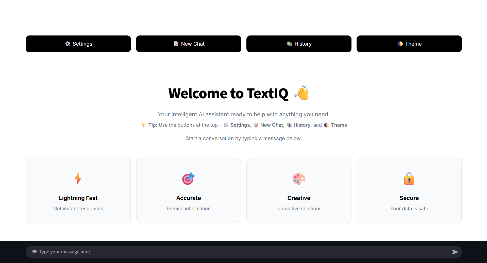
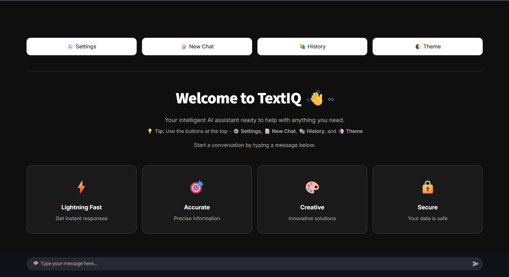
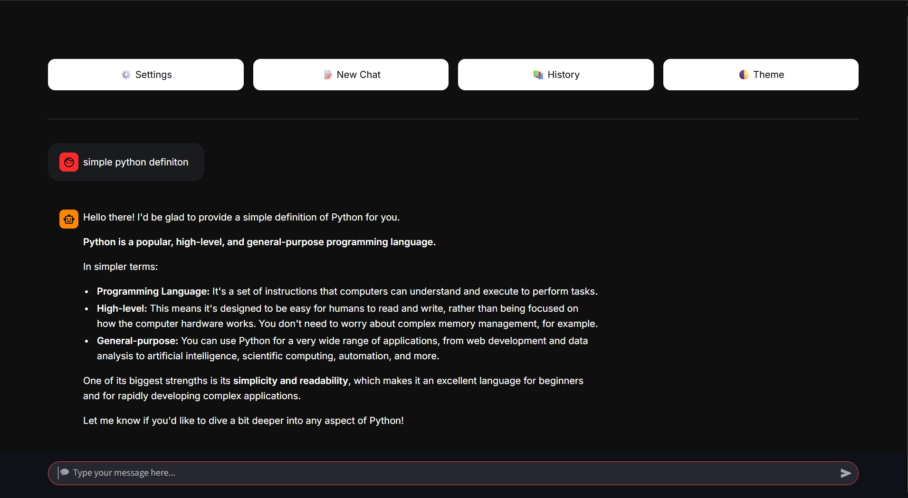
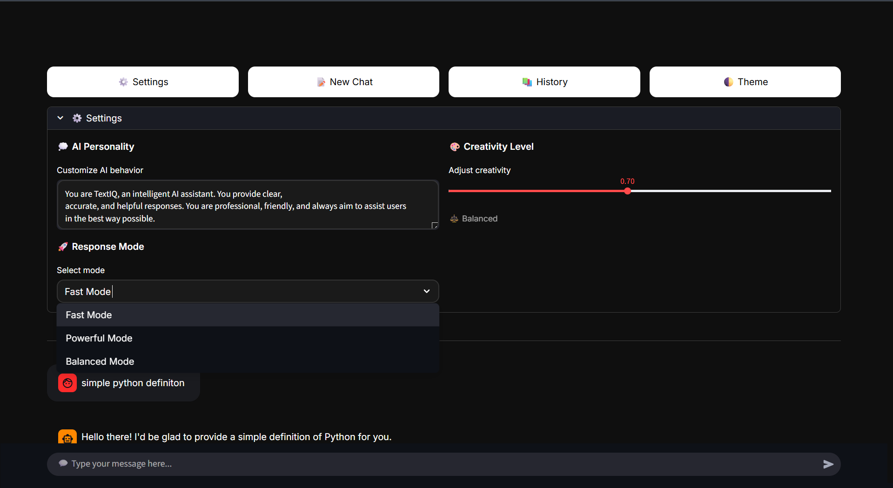
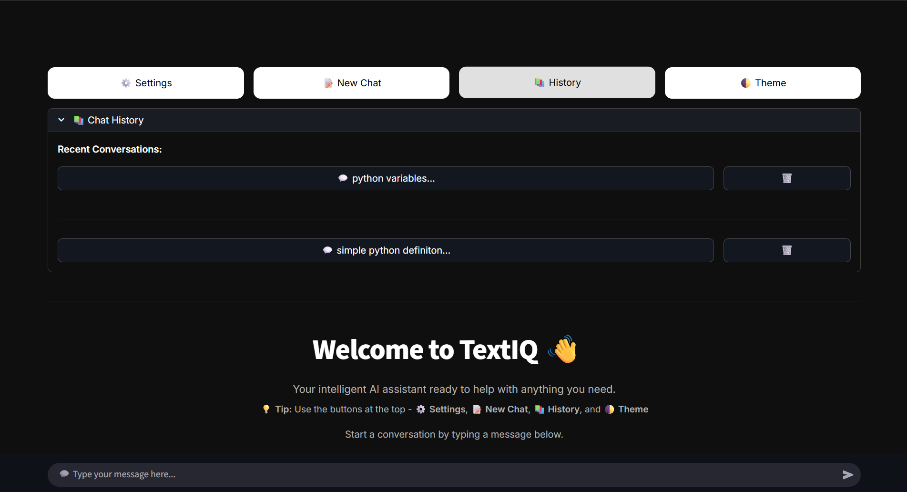

# TextIQ - AI Chat Assistant

An intelligent conversational AI application with a modern, intuitive interface. Built with Streamlit and powered by Google's Gemini AI models.

**Live Demo:** [https://textiq-chat.streamlit.app](https://textiq-chat.streamlit.app)

**GitHub:** [https://github.com/yaswanth09-tech/TextIQ](https://github.com/yaswanth09-tech/TextIQ)

---

## Screenshots

### Light Mode


### Dark Mode


### Chat Interface


### Settings Panel


### Chat History


---

## Features

- **Multiple AI Modes**
  - Fast Mode (gemini-2.5-flash) - Quick responses for everyday tasks
  - Powerful Mode (gemini-2.5-pro) - Advanced reasoning for complex queries
  - Balanced Mode (gemini-1.5-flash) - Optimal balance of speed and capability

- **Customizable Experience**
  - Adjust AI personality with custom system prompts
  - Control creativity level with temperature slider (0.0 - 1.5)
  - Switch between dark and light themes
  - Modern, iMessage-style chat interface

- **Chat Management**
  - Save and load conversation history
  - View all past chats with timestamps
  - Delete unwanted conversations
  - Automatic chat saving when starting new conversations

- **User Interface**
  - Clean, responsive design
  - Smooth animations and transitions
  - Mobile-friendly layout
  - Easy-to-use settings panel

---

## Tech Stack

**Frontend & Framework**
- [Streamlit](https://streamlit.io/) - Web application framework
- Custom CSS - Modern UI styling with dark/light mode support

**AI & Backend**
- [Google Gemini AI](https://ai.google.dev/) - Large language model API
  - gemini-2.5-flash (Fast Mode)
  - gemini-2.5-pro (Powerful Mode)
  - gemini-1.5-flash (Balanced Mode)

**Dependencies**
- `streamlit>=1.32.0` - Web framework
- `google-generativeai>=0.3.0` - Gemini AI SDK
- `python-dotenv>=1.0.0` - Environment variable management

**Storage**
- Local JSON file storage for chat history
- Streamlit Cloud secrets for API key management

**Deployment**
- Streamlit Community Cloud (Free hosting)

---

## How to Run It

### Prerequisites

- Python 3.8 or higher
- Google Gemini API key ([Get one free here](https://makersuite.google.com/app/apikey))

### Local Setup

**1. Clone the repository**
```bash
git clone https://github.com/yaswanth09-tech/TextIQ.git
cd TextIQ
```

**2. Install dependencies**
```bash
pip install -r requirements.txt
```

**3. Set up your API key**

Create a `.env` file in the project root:
```
GEMINI_API_KEY=your_api_key_here
```

**4. Run the application**
```bash
streamlit run app.py
```

The app will open automatically in your browser at `http://localhost:8502`

### Testing Your Setup

Verify everything is configured correctly:

```bash
# Quick API key test (5-10 seconds)
python test_api.py

# Comprehensive validation (optional)
python testing.py
```

### Deploy to Streamlit Cloud

**1. Push your code to GitHub** (without the `.env` file)

**2. Go to [Streamlit Cloud](https://share.streamlit.io/)**

**3. Deploy your app**
- Click "New app"
- Select your repository: `yaswanth09-tech/TextIQ`
- Branch: `main`
- Main file: `app.py`

**4. Add your API key in Secrets**

Click "Advanced settings" and add:
```toml
GEMINI_API_KEY = "your_actual_api_key_here"
```

**5. Click Deploy**

Your app will be live in 2-3 minutes!

---

## Project Structure

```
TextIQ/
├── app.py                 # Main application
├── test_api.py            # API key verification tool
├── testing.py             # Comprehensive test suite
├── requirements.txt       # Python dependencies
├── .env                   # API key (local only - not in git)
├── .env.example           # Environment template
├── .gitignore             # Git ignore rules
├── README.md              # Documentation
├── QUICKSTART.md          # Quick setup guide
├── screenshots/           # App screenshots
│   ├── light-mode.png
│   ├── Dark-mode.png
│   ├── chat-interface.png
│   ├── settings.png
│   └── history.png
└── chat_history.json      # Saved chats (auto-generated)
```

---

## Usage Guide

### Starting a Conversation

1. Type your message in the chat input at the bottom
2. Press Enter to send
3. Wait for the AI response

### Changing Settings

1. Click the "Settings" button
2. Customize:
   - AI Personality - Define how the AI behaves
   - Response Mode - Choose Fast, Powerful, or Balanced
   - Creativity Level - Adjust from 0.0 (focused) to 1.5 (creative)

### Managing Chats

- **New Chat** - Saves current conversation and starts fresh
- **History** - View all saved conversations
- **Load Chat** - Click any saved chat to continue it
- **Delete Chat** - Remove unwanted conversations

### Switching Themes

Click the "Theme" button to toggle between dark and light modes.

---

## Configuration

### Environment Variables

| Variable | Description | Required |
|----------|-------------|----------|
| `GEMINI_API_KEY` | Your Google Gemini API key | Yes |

### Default Settings

```python
# AI Models
MODELS = {
    "Fast Mode": "gemini-2.5-flash",
    "Powerful Mode": "gemini-2.5-pro",
    "Balanced Mode": "gemini-1.5-flash"
}

# Default AI Personality
DEFAULT_SYSTEM_PROMPT = """You are TextIQ, an intelligent AI assistant. 
You provide clear, accurate, and helpful responses. You are professional, 
friendly, and always aim to assist users in the best way possible."""

# Default Creativity Level
DEFAULT_TEMPERATURE = 0.7
```

---

## Testing Tools

### test_api.py - Quick API Verification

Performs a rapid check of your API key and connectivity.

**Run it:**
```bash
python test_api.py
```

**What it tests:**
- Package installation
- API key format and validity
- Connection to Gemini API
- Message generation capability

### testing.py - Comprehensive Test Suite

Validates all application components and features.

**Run all tests:**
```bash
python testing.py
```

**Quick check only:**
```bash
python testing.py quick
```

**Individual tests:**
```bash
python testing.py api       # Test API connection
python testing.py models    # Test all AI modes
python testing.py history   # Test chat history
```

**What it tests:**
- Environment variables
- Package imports
- API connectivity
- All three AI models
- Chat history system
- Temperature configuration
- File structure
- Session state

---

## Security & API Key Protection

### Hide Your API Key on GitHub

**1. Create `.gitignore` file:**
```
.env
__pycache__/
*.pyc
venv/
chat_history.json
```

**2. Create `.env.example` template:**
```
GEMINI_API_KEY=your_api_key_here
```

**3. Never commit `.env` file:**
```bash
# Check what will be uploaded
git status

# .env should NOT appear in the list
```

### If You Accidentally Exposed Your API Key

1. **Immediately revoke it:** Go to [Google AI Studio](https://makersuite.google.com/app/apikey) and delete the exposed key
2. **Generate a new key**
3. **Update your `.env` file** with the new key
4. **Never commit `.env` again**

---

## Troubleshooting

### API Key Issues

**Problem:** "API key not configured"

**Solution:**
```bash
# Run diagnostic
python test_api.py

# Verify .env file exists and contains:
GEMINI_API_KEY=your_key_here
```

### Rate Limiting

**Problem:** "Usage limit reached"

**Solution:**
- Free tier: 60 requests/minute, 1500/day
- Wait a few minutes before trying again
- Consider upgrading your API plan

### Import Errors

**Problem:** "Module not found"

**Solution:**
```bash
# Reinstall dependencies
pip install -r requirements.txt --upgrade
```

### Chat History Not Saving

**Problem:** Conversations aren't being saved

**Solution:**
```bash
# Test the chat history system
python testing.py history

# Check file permissions
# Ensure app has write access to the directory
```

---

## API Usage Tips

**Optimize Your API Usage:**
- Use Fast Mode for simple questions
- Reserve Powerful Mode for complex reasoning
- Lower temperature for factual queries
- Raise temperature for creative tasks

**Monitor Your Usage:**
- Check quota at: https://makersuite.google.com/app/apikey
- Free tier limits: 60 requests/min, 1500/day
- Set up usage alerts if needed

---

## Source Code Overview

The `app.py` file is organized into clear sections:

**Configuration** (Lines 1-45)
- Imports and dependencies
- Streamlit Cloud secrets with local .env fallback
- Model definitions and constants

**Chat History Functions** (Lines 47-110)
- Save, load, and delete chat operations
- JSON file management

**CSS Styling** (Lines 112-495)
- Dynamic theme system
- Custom chat bubble styling
- Responsive design

**AI Response Generation** (Lines 497-560)
- Gemini API integration
- System prompt handling
- Error management

**User Interface** (Lines 562-end)
- Streamlit page configuration
- Session state management
- Sidebar and main chat area
- Message handling

---

## Customization

### Modify AI Personality

Edit the system prompt in Settings:
```python
"You are a friendly, casual AI who uses simple language."
```

### Add New Models

Update the MODELS dictionary in `app.py`:
```python
MODELS = {
    "Fast Mode": "gemini-2.5-flash",
    "Your Mode": "new-model-name"
}
```

### Change Theme Colors

Edit the `load_custom_css()` function around line 120:
```python
bg_color = "#0f0f0f"  # Your color here
```

---

## Contributing

Contributions are welcome! To contribute:

1. Fork the repository
2. Create a feature branch: `git checkout -b feature-name`
3. Commit changes: `git commit -m 'Add feature'`
4. Push to branch: `git push origin feature-name`
5. Open a Pull Request

---

## License

This project is available under the MIT License. You're free to use, modify, and distribute it as needed.

---

## Acknowledgments

- Built with [Streamlit](https://streamlit.io/)
- Powered by [Google Gemini AI](https://ai.google.dev/)
- UI inspired by modern messaging apps

---

## Support

**Having issues?**
1. Check the Troubleshooting section above
2. Run diagnostic tests: `python test_api.py`
3. Review error messages in the terminal
4. Open an issue on GitHub with details

---

## Future Development

Planned features for upcoming versions:
- File upload support (images, PDFs, documents)
- Export chat history (JSON, CSV, PDF)
- Voice input and output
- Code syntax highlighting
- Search within conversations
- Multi-language support
- Streaming responses for real-time output
- User authentication system

---

**TextIQ** - Built with Streamlit and Google Gemini AI

**Live Demo:** [https://textiq-chat.streamlit.app](https://textiq-chat.streamlit.app)

**GitHub Repository:** [https://github.com/yaswanth09-tech/TextIQ](https://github.com/yaswanth09-tech/TextIQ)

**Made by:** [Yaswanth Nara](https://github.com/yaswanth09-tech)
